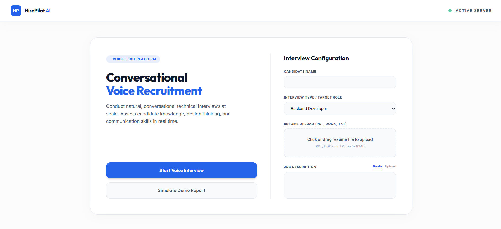
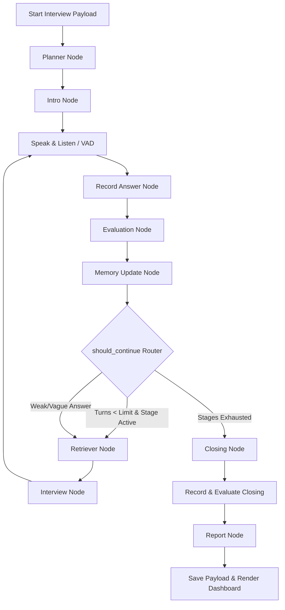

# HirePilot AI — Enterprise AI Voice Recruiter Platform



HirePilot AI is an advanced, voice-first adaptive technical recruiter platform. By combining a structured state-machine driven by **LangGraph**, reasoning models from **Groq Llama**, vector-store retrieval via **FAISS**, and an interactive, clean **light-mode SaaS UI**, it transforms raw candidate resumes and job descriptions into an immersive, conversational live screening experience.

---

## 🗺️ Architectural Workflow

The entire interview lifecycle is managed as a stateful graph using **LangGraph**. The following diagram illustrates how the candidate's state progresses from initial planning down to evaluation, memory updates, and report generation:



---

## 🧠 Core System Deep Dives

### 1. LangGraph State Engine
The state machine is defined using a state schema (`GraphState` and `InterviewState`). Rather than executing a hardcoded sequence of questions, the interview is fully LLM-driven:
- **Planner Node**: Triggered at Turn 0. It takes the candidate's parsed resume and target job description, compiles key categories (e.g. *Technical Skills*, *Problem Solving*, *Behavioral*, *Job Fit*), and writes an optimized agenda.
- **Decision Router (`should_continue`)**: At the end of every turn, a conditional router assesses progress:
  - Tracks turns spent in the current stage (`stage_turns`).
  - Evaluates the overall score of the last response. If the score is very weak (Score < 2.0) or vague, it loops back to the RAG/Interview nodes to prompt a follow-up or challenge, keeping the candidate in the stage.
  - Automatically advances stages when the minimum turn count is met.
- **Memory Node**: Adjusts active question difficulty levels (`easy`, `intermediate`, `advanced`, `architecture`, `system_design`) dynamically based on recent scoring signals.

### 2. Conversational Feedback & Corrective Dialogue
The platform establishes a tight loop between the **Evaluation Agent** and the **Interview Agent**:
- **Evaluation Feedback Feed**: The detailed feedback from the evaluator (score, rationale, detected strengths, and weaknesses) is injected into the Interview Agent's prompt context for the next turn.
- **Adaptive Dialogue**: Instead of ignoring candidate errors, the AI interviewer actively adapts:
  - *Acknowledges good responses* with natural expressions like *"Makes sense"* or *"I like that design decision"*.
  - *Identifies misconceptions* (e.g., if a candidate claims RAG retrains an LLM) and prompts conversational corrections: *"FastAPI is usually chosen for asynchronous support. How did you structure your routes?"*
  - *Challenging or clarifying* vague replies before advancing.

### 3. Client-Side Document Parsing & RAG Pipeline
To comply with low-overhead, offline-first structures, document parsing is managed client-side in the browser:
- **PDF Extraction**: Uses `pdf.js` to process document page content arrays directly in the client.
- **DOCX Extraction**: Uses `mammoth.js` to parse document XML text structures natively in the browser.
- **Ingestion & Embedding**: Once extracted, the raw text is submitted to the backend RAG pipeline.
  - Documents are processed into semantic segments via the custom embedding model (`HashingEmbeddingModel`).
  - Loaded into a local **FAISS** vector store.
  - During the interview, the **Retriever Node** performs vector searches based on the latest question and answer contexts to feed relevant developer guidelines or credentials to the LLM prompt.

### 4. Low-Latency Voice Activity Detection (VAD) & Audio Pipeline
To mimic natural human conversation, speech lag must be minimal. HirePilot AI implements three custom latency optimizations:
- **Native Windows MCI Player (`winmm.dll`)**: Plays generated TTS audio files using native Windows Media Control strings via Python's standard `ctypes` library. This removes the **1.5-second process creation delay** that occurs when spawning PowerShell sub-shells.
- **Groq Cloud Whisper STT**: Audio recordings are forwarded to Groq's cloud-hosted `whisper-large-v3` API, returning transcripts in **under 100ms** (with offline fallback to local CPU `faster-whisper` models).
- **Sub-Second VAD Silence Gates**: Calibrated VAD parameters to stop recording exactly **700ms** after a candidate pauses speaking, keeping transitions snappier.

---

## 📡 API Reference & Endpoints

### 1. Start Voice Interview
Initializes the LangGraph state machine, builds the plan, generates the greeting, and begins listening.

* **URL**: `/api/start-voice-interview`
* **Method**: `POST`
* **Request Payload**:
```json
{
  "candidate_name": "Ava Lee",
  "resume_text": "Python, FastAPI, Postgres...",
  "jd_text": "Backend Developer specializing in AI integrations...",
  "interview_type": "GenAI Engineer"
}
```
* **Response**:
```json
{
  "state": {
    "candidate_name": "Ava Lee",
    "interview_stage": "introduction",
    "current_question": "Hi Ava, I'm Alex...",
    "previous_questions": ["Hi Ava, I'm Alex..."],
    "previous_answers": [],
    "current_scores": [],
    "topics_covered": ["introduction"]
  },
  "next_step": "retriever"
}
```

### 2. Next Voice Turn
Processes the candidate's last answer, generates scores/comments, runs the RAG search, synthesizes the next question, and records the reply.

* **URL**: `/api/next-voice-turn`
* **Method**: `POST`
* **Request Payload**: The full, serialized `InterviewState` dictionary returned by the previous endpoint.
* **Response**:
```json
{
  "state": { ... },
  "next_step": "retriever",
  "report": null
}
```
*When `next_step` transitions to `"report"`, the response contains the compiled `report` payload.*

---

## 🛠️ Installation & Environment Configuration

### 1. Prerequisites
- **Python**: version `3.11` or higher.
- **Microphone & Sound Card**: Required for VAD audio capture.

### 2. Setup Commands
```powershell
# Clone the repository
git clone https://github.com/anumitha21/HirePilot-AI.git
cd HirePilot-AI

# Create virtual environment
python -m venv .venv
.\.venv\Scripts\Activate.ps1

# Install package and server runtimes
python -m pip install -e .
python -m pip install pytest fastapi uvicorn
```

### 3. Environmental Variable Config (`.env`)
Create a `.env` file in your root folder:
```env
# Groq API Key Configuration
GROQ_API_KEY=your_groq_api_key

# Fast Llama 3.1 8B Instant Models for sub-200ms completions
GROQ_EXTRACTION_MODEL=llama-3.1-8b-instant
GROQ_PLANNER_MODEL=llama-3.1-8b-instant
GROQ_INTERVIEW_MODEL=llama-3.1-8b-instant
GROQ_EVALUATION_MODEL=llama-3.1-8b-instant

# Voice Activity Detection (VAD) Calibration
VOICE_RECORD_SECONDS=5
VOICE_MAX_RECORD_SECONDS=45
VOICE_SILENCE_SECONDS=0.7
VOICE_VAD_THRESHOLD=0.004
VOICE_SAMPLE_RATE=16000
VOICE_TTS_VOICE=en-US-JennyNeural
```

### 4. Run Server
```powershell
python -m uvicorn backend.app:app --host 127.0.0.1 --port 8000
```
Open **[http://127.0.0.1:8000/](http://127.0.0.1:8000/)** in your web browser.

---

## 🧪 Testing Suite
Run the regression test cases to check state preservation, RAG embeddings, and scoring metrics:
```powershell
python -m pytest backend/tests/
```
All cases run deterministically and mock standard hardware endpoints.
